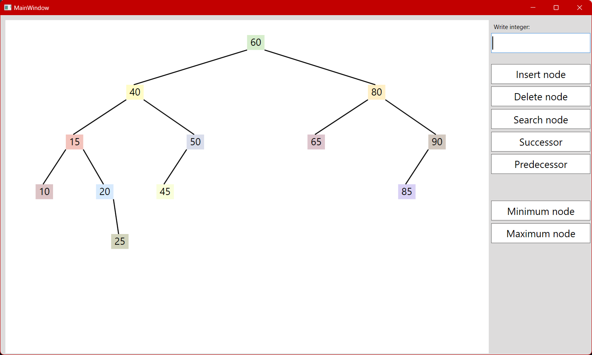

# AVLTree

An AVL tree is a self-balancing binary search tree. It ensures that the height difference
between its left and right subtrees is limited to a maximum of one. This balance
property helps maintain efficient insertion, deletion, and search operations, 
reducing the risk of performance degradation in comparison to non-balanced binary search trees.

